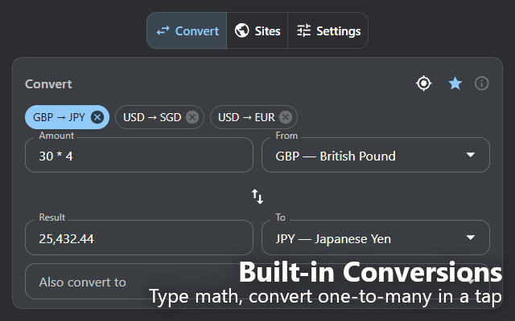
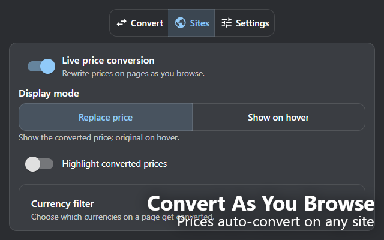

# OpenConvert

An open-source Manifest V3 Chrome extension that converts currencies by rewriting prices live on the web pages you visit, along with a standard popup converter. Everything runs locally on your machine, so there are no accounts and no privacy concerns.

## Install

- Chrome Web Store: coming soon
- [Build it from source](#installation-from-source)

## Features

### Popup Converter



- Target conversion as you type, with a swap button and pinned quick-swap pairs
- See one amount converted into several currencies at once
- Inline math in the amount field, like `12 + 4.50`, for tallying items by hand
- Press a button to auto-detect the current page's currency
- Reads prices out of PDFs and pulls them into the popup. PDFs can't be live-converted the way web pages are, since the built-in viewer doesn't allow it.

### Live Page Conversion



- Detects currency symbols, qualifiers, and ISO codes, with locale-aware disambiguation for shared symbols like `$` and `¥`
- Rewrites matched prices in place and keeps the original on hover
- Per-site allow and deny lists, plus a per-site target currency override
- A from-currency filter to limit which source currencies get converted
- Configurable decimal precision and number formatting

## Installation (from source)

If you would rather build it yourself than wait for the store listing:

1. Clone the repo and install dependencies:
   ```
   git clone https://github.com/alasteralfio/ship30-01-openconvert.git
   cd ship30-01-openconvert
   npm install
   ```
2. Build the extension. This writes the unpacked extension to `dist/`:
   ```
   npm run build
   ```
3. Open `chrome://extensions`, turn on Developer mode (top right), click Load unpacked, and pick the `dist/` folder.

To update later, pull the latest changes, run `npm run build` again, and hit the reload icon on the extension card.

## Development

- `npm run dev` builds in watch mode while you work
- `npm run build` produces the production build in `dist/`
- `npm run lint` runs ESLint
- `npm test` runs the unit tests

The popup is React and Material UI. The content script and service worker are plain TypeScript with no framework. Vite and the CRXJS plugin handle the build. Exchange rates come from a free, no-key API: the service worker fetches one rate table, caches it, and every conversion is done locally from that table, so there is no network request per price.

## License

MIT. See [LICENSE](LICENSE).
